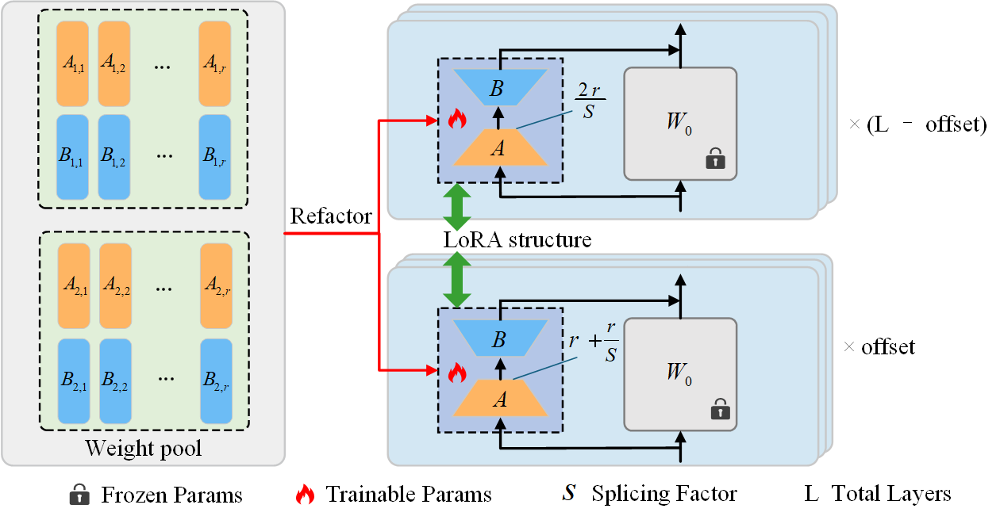

# SLoRA: Shared Low-Rank Adaptation for Parameter-Efficient Fine-Tuning of Large Language Models

SLoRA (Shared Low-Rank Adaptation) is a method that constructs LoRA structures with different effective ranks within large models through global sharing, which can reduce the number of trainable parameters while achieving good performance.
<div align="center">
    
</div>


## Training and Evaluation

```
bash scripts/run_slora.sh
```


## Acknowledgements

Our code is based on LoRI.
```
@article{zhang2025lori,
  title={LoRI: Reducing Cross-Task Interference in Multi-Task Low-Rank Adaptation},
  author={Zhang, Juzheng and You, Jiacheng and Panda, Ashwinee and Goldstein, Tom},
  journal={arXiv preprint arXiv:2504.07448},
  year={2025}
}
```
