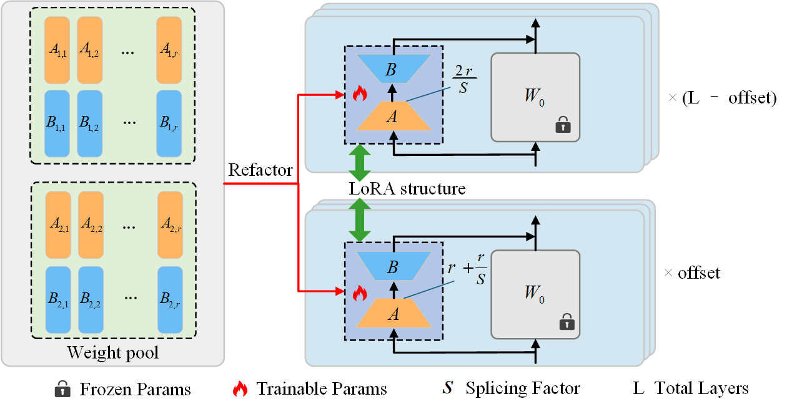

# SLoRA: Shared Low-Rank Adaptation for Parameter-Efficient Fine-Tuning of Large Language Models

SLoRA (Shared Low-Rank Adaptation) is a method that constructs LoRA structures with different effective ranks within large models through global sharing, which can reduce the number of trainable parameters while achieving good performance.
<div align="center">
    
</div>


## Training and Evaluation

```
bash scripts/run_slora.sh
```


## Erratum for Table 2
The conference camera-ready version could not be updated after the submission deadline. Therefore, we provide the corrected table here for reference.

A transcription error was identified in Table 2 of the conference version. During manuscript preparation, the GPU memory usage values corresponding to rank = 64 were inadvertently copied from the rank = 32 configuration and were not updated accordingly. The correct GPU memory usage values for rank = 64 should be twice those reported in the published table.

This correction is limited to the numerical values presented in Table 2. The experiments were conducted using the correct configurations, and all analyses and conclusions remain unchanged.

The corrected Table 2 is shown below.


## Acknowledgements

Our code is based on LoRI.
```
@article{zhang2025lori,
  title={LoRI: Reducing Cross-Task Interference in Multi-Task Low-Rank Adaptation},
  author={Zhang, Juzheng and You, Jiacheng and Panda, Ashwinee and Goldstein, Tom},
  journal={arXiv preprint arXiv:2504.07448},
  year={2025}
}
```
